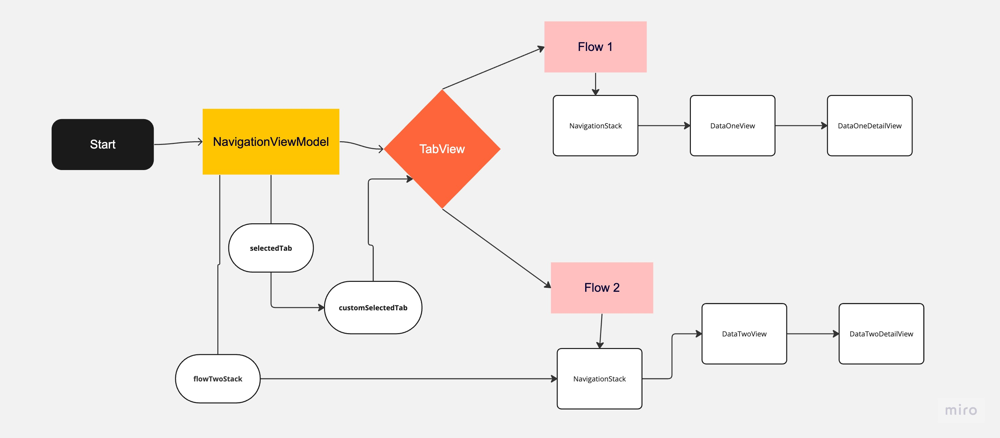

# Navigation And Tabs

This example is sourced from https://notificare.com/blog/2022/11/25/a-better-tabview-in-swiftui/

This repo is comprised of a TabView housing two navigation flows (separate NavigationStack respectively).
iOS 16 is the current version of this work and demonstrates the usage of NavigationStack and NavigationLink
in that context.

The chart above depicts the architecture of navigation where:

1. NavigationViewModel houses the states that keep track of the currently selected tab of TabNavigation and the stored value(s) that will be shown as NavigationLinks
2. TabView contains two main tabs that can be switched between
3. Flow 1 is the umbrella which demonstrates the basics of the NavigationStack/Navigation link in iOS 16 and the views that are part of the flow
4. Flow 2 is the umbrella which aims to solve a particular problem in navigation where clicking on an already selected tab (from TabView) should take you back to the root view of that tab.